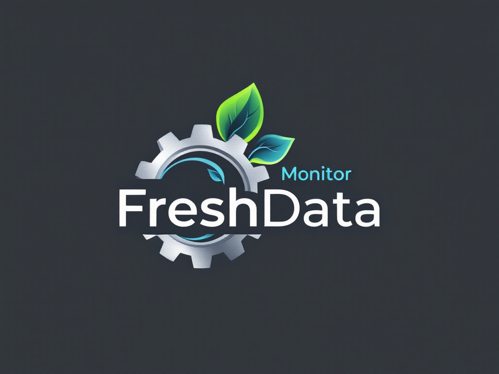

# FRESHDATA MONITOR

<div align="center">
  
</div>

## Description
FRESHDATA MONITOR est une application développée pour le LEA Robert Doisneau (Saint-Lô) permettant le suivi des températures des chambres froides de la cuisine et la centralisation des données d'hygiène.

## Description
FRESHDATA MONITOR est une application développée pour le LEA Robert Doisneau (Saint-Lô) permettant le suivi des températures des chambres froides de la cuisine et la centralisation des données d'hygiène.

> Documentation détaillée disponible dans [`docs/docs.md`](docs/docs.md)

## Fonctionnalités
- Visualisation graphique des données
- Gestion des authentifications
- Export et sauvegarde des données
- Interface administrateur
- Gestion des stocks et du suivie des livraisons (prochainement )
- Gestion des tâches ménagère(Prochainement)
- Suivi en temps réel des températures(Prochainement)

## Installation
1. Cloner le repository
2. Installer les dépendances :
```
pip install -r requirements.txt
```

## Utilisation
1. Lancer `main.py` pour démarrer l'application
2. Se connecter avec les identifiants suivant pour se connecter en tant que prof (ID = admin ; password = "1234")
3. Accéder aux différentes fonctionnalités via le menu

## Dépendances
- matplotlib
- pillow
- tkinter
- sqlite3
- csv
- datetime
- os

## Développé par
- Ewald Lemarchant
- Elouan Guillon  
- Raphael Le Provost

##

## Licence
Ce projet est sous licence MIT. Voir le fichier LICENSE pour plus de détails.